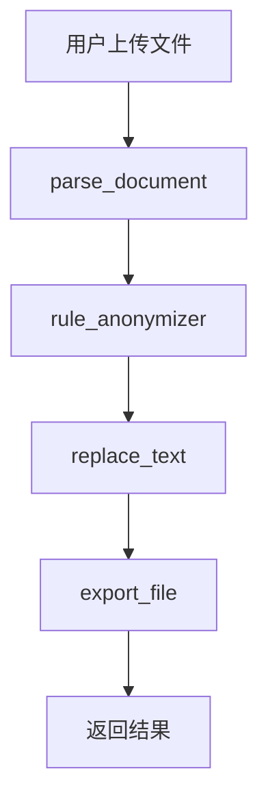

# LangChain 法律文件脱敏智能体 - 使用指南

## 🚀 快速启动

### 方式1: 使用 PowerShell 脚本（推荐）
```powershell
# 在项目根目录执行
.\start-langchain.ps1
```

### 方式2: 使用 Batch 脚本
```cmd
# 双击或在命令行执行
start-langchain.bat
```

### 方式3: 手动启动
```bash
cd tm-agent/backend
python main_langchain.py
```

## 📋 功能测试

### 1. 运行完整测试
```bash
cd tm-agent/backend
python test_langchain_agent.py
```

测试内容包括：
- ✅ 对话功能测试
- ✅ 工具功能测试  
- ✅ 完整文档处理流程
- ✅ API 调用模拟

### 2. 健康检查
访问: http://localhost:8001/api/health

## 🌐 API 使用示例

### 智能体对话
```bash
curl -X POST "http://localhost:8001/api/chat" \
     -H "Content-Type: application/json" \
     -d '{
       "message": "你好，我想处理一个法律文档",
       "session_id": "test-session"
     }'
```

### 文件上传处理
```bash
curl -X POST "http://localhost:8001/api/upload-and-process" \
     -F "file=@document.pdf" \
     -F "config={\"mask_char\":\"●\",\"keep_prefix\":2,\"keep_suffix\":2}"
```

### 获取工具列表
```bash
curl "http://localhost:8001/api/tools"
```

## 🔧 配置说明

### 脱敏规则
- `IDCARD` - 身份证号码
- `PHONE` - 手机号码  
- `EMAIL` - 邮箱地址
- `BANKCARD` - 银行卡号
- `CASE_NUMBER` - 法院案号

### 脱敏参数
```json
{
  "enabled_rules": ["IDCARD", "PHONE", "EMAIL"],
  "mask_char": "●",
  "keep_prefix": 2,
  "keep_suffix": 2
}
```

### 效果示例
```
原文: 13812345678
脱敏: 13●●●●●●78
```

## 🛠️ LangChain 工具链

### 1. parse_document
- **功能**: 解析文档提取文本
- **支持**: PDF, Word (.docx, .doc)
- **参数**: `file_path` - 文件路径

### 2. rule_anonymizer  
- **功能**: 识别敏感实体
- **参数**: 
  - `text` - 文本内容
  - `enabled_rules` - 启用规则列表

### 3. replace_text
- **功能**: 文本脱敏处理
- **参数**:
  - `text` - 原始文本
  - `mapped_entities` - 实体列表
  - `mask_char` - 遮罩字符
  - `keep_prefix/suffix` - 保留字符数

### 4. export_file
- **功能**: 导出脱敏文件
- **参数**:
  - `content` - 文件内容
  - `filename` - 文件名
  - `export_dir` - 导出目录

## 📱 Web 界面

### API 文档
- 访问: http://localhost:8001/docs
- 提供完整的交互式 API 文档
- 支持在线测试所有接口

### 主要接口
- `/api/chat` - 智能体对话
- `/api/upload-and-process` - 文件上传处理
- `/api/process-document` - 文档处理
- `/api/download/{filename}` - 文件下载
- `/api/export-list` - 导出文件列表

## 🔍 Agent 工作流程



1. **文档解析**: 从 PDF/Word 提取文本内容
2. **实体识别**: 识别身份证、手机号等敏感信息
3. **脱敏处理**: 按规则进行遮罩处理
4. **文件导出**: 生成脱敏后的文档

## 💡 使用技巧

### 批量处理
```python
import asyncio
from langchain_agent import anonymizer_agent

async def batch_process():
    files = ["doc1.pdf", "doc2.docx", "doc3.pdf"]
    results = []
    
    for file_path in files:
        result = await anonymizer_agent.process_document(file_path)
        results.append(result)
    
    return results
```

### 自定义脱敏规则
```python
config = {
    "enabled_rules": ["IDCARD", "PHONE"],  # 只脱敏身份证和手机号
    "mask_char": "█",                      # 使用不同遮罩字符
    "keep_prefix": 3,                      # 保留更多前缀
    "keep_suffix": 3
}
```

### 会话管理
```python
# 保持对话上下文
session_responses = []

for message in user_messages:
    response = await agent.chat(message)
    session_responses.append(response)
```

## 🔧 故障排除

### 常见问题

1. **端口占用**
   ```bash
   # 检查端口占用
   netstat -ano | findstr :8001
   ```

2. **依赖缺失**
   ```bash
   # 重新安装依赖
   pip install -r requirements-langchain.txt
   ```

3. **权限问题**
   ```bash
   # 以管理员身份运行PowerShell
   Set-ExecutionPolicy -ExecutionPolicy RemoteSigned -Scope CurrentUser
   ```

### 日志查看
服务运行时会显示详细日志，包括：
- 请求处理状态
- 错误信息
- 性能指标

### 性能优化
- 大文件处理可能需要时间，建议设置超时
- 可以调整脱敏规则减少处理时间
- 批量处理时建议控制并发数

## 📞 支持

如遇问题，可以：
1. 查看控制台输出日志
2. 运行测试脚本确认功能
3. 访问 API 文档进行调试
4. 检查文件权限和路径设置
